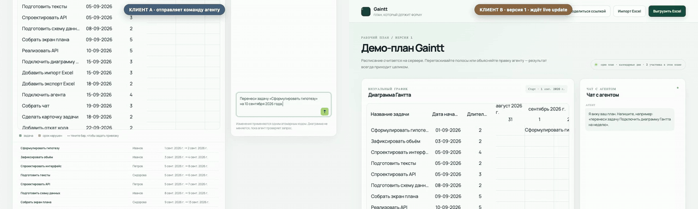

# Kanbain

Kanbain — редактор одного Plan: мышью на диаграмме Гантта или естественным языком
через Agent. Schedule вычисляется на сервере из Durations, Predecessors и Pinned
Starts; в Excel он выгружается отдельным листом.

## Быстрый запуск

Требования: Python 3.11+ (нужен `honker`), [uv](https://docs.astral.sh/uv/),
Node.js 22+ и [pnpm](https://pnpm.io/).

```bash
uv sync --dev
cd frontend
pnpm install
pnpm build
cd ..
uv run uvicorn kanbain.main:app --reload
```

Откройте <http://127.0.0.1:8000>. SQLite создаётся в `data/kanbain.sqlite` и
работает в WAL-режиме. Для живого OpenRouter задайте `OPENROUTER_API_KEY` в
окружении; ключ не хранится в репозитории. Без ключа включается детерминированный
demo interpreter, поэтому smoke-тест не ходит в сеть.

Проверки:

```bash
make test
```

Для Playwright один раз установите браузер: `pnpm exec playwright install chromium`.

Пример входного файла — [examples/kanbain-example.xlsx](examples/kanbain-example.xlsx).

## Совместное редактирование

Второй участник открывает ссылку `/plan/{id}` и получает право редактировать
этот Plan наравне с первым — тем же способом мышью или чатом. Диаграмма у него
обновляется сама, без перезагрузки: сервер публикует `{plan_id, version}` в
Honker (durable pub/sub поверх того же SQLite-файла) после каждой успешной
записи, клиент держит SSE-подписку и при отставании версии перезапрашивает Plan
целиком. Событие никогда не несёт данные Plan, только сигнал перечитать — так
устроено ровно для того, чтобы потеря одного сигнала лечилась следующим,
переподключением или серверной сверкой версии раз в пять секунд, а не постоянным
расхождением состояния. Подробности и разбор отменённого
решения — в [ADR-0003](docs/adr/0003-honker-collaborative-editing.md).

**Модель доступа — capability-URL, и у неё есть цена.** `plan_id` — uuid4;
знание ссылки и есть право на запись, отдельного логина нет. Это значит:

- ссылка может утечь в историю браузера, в HTTP-реферер при переходе на внешний
  сайт или в случайную пересылку — тому, кто её увидел, не нужно ничего, кроме
  самой ссылки;
- отозвать доступ у одного конкретного участника нельзя — можно только начать
  новый Plan;
- это осознанный компромисс ради совместности без полноценной аутентификации, а
  не забытая проверка — см. roadmap, раздел «Аутентификация и доступ».

Приложение по-прежнему держится на одном процессе и одном SQLite-файле —
Honker слушает уведомления в том же файле, поэтому второй инстанс не увидел бы
сигналов о правках с первого. Это первый пункт [roadmap](docs/ROADMAP.md).

## Архитектура

```text
React + SVAR Gantt
        │ HTTP: /api/plan, /api/plan/{id}, /api/turn, /api/chat, /api/import, /api/export
        │ SSE:  /api/plan/{id}/events  (signal only: {plan_id, version})
        ▼
FastAPI ── AgentService ── model: JSON {mutations, reply}
   │              │
   │              └── InMemoryMCPClient ── FastMCP tools ── PlanService
   ├── PlanService ── SQLite (one process, one file)  │
   │        └── PlanNotifier ── Honker (same file) ── same apply_turn seam
   ├── Excel adapter
   └── static frontend
```

Домен (`kanbain/domain.py`) не знает о FastAPI и базе. Единственный writer —
`PlanService.apply_turn(plan_id, base_version, mutations[])`: он клонирует Plan,
валидирует весь список, считает Schedule, пишет снапшот Turn и увеличивает версию
одним SQLite-транзакционным обновлением. Ошибка цикла, неизвестного Task или
устаревшей версии не оставляет частичного состояния.

`@svar-ui/react-gantt@2.7.1` используется как controlled view. Финальный
`update-task` перехватывается и отменяется, а его календарный `diff` превращается
в ту же Mutation `pin_start`, которую может создать чат. Auto-scheduling
библиотеки не включён: единственный Schedule — тот, что рассчитан backend.

## MCP

Внутренний Agent использует in-memory MCP transport. Доступны `get_plan`,
`find_tasks` и `apply_turn`; тул-слой тонкий и делегирует в PlanService. HTTP MCP
выключен по умолчанию. Для локального Inspector:

```bash
MCP_HTTP_ENABLED=true MCP_WRITE_TOKEN=local-token \
  uv run uvicorn kanbain.main:app --host 127.0.0.1 --port 8000
```

Без `Authorization: Bearer local-token` внешний клиент видит только read-only
тулы. В production сначала задайте корректный host allowlist транспортного слоя,
затем включайте endpoint за auth/reverse proxy.

Граница здесь намеренно узкая: модель сама не вызывает MCP tools. Она получает
свежий snapshot Plan и возвращает JSON `{mutations, reply}`, после чего
`AgentService` вызывает `apply_turn` через настоящий in-memory MCP transport.
`find_tasks` доступен MCP-клиентам, но текущий LLM path не использует его как
tool-calling loop. Поэтому MCP участвует в каждом Agent Turn, но управляет им
orchestration, а не модель.

## AI-ассистенты и процесс разработки

AI здесь использовался как инженерный партнёр с проверяемыми границами, а не как
непрозрачный генератор кода. Глоссарий Plan/Task/Schedule/Mutation/Turn и правила
терминов зафиксированы в [CONTEXT.md](CONTEXT.md); принятые решения собраны в
[docs/DESIGN.md](docs/DESIGN.md), а необратимые выборы объяснены в
[ADR-0001](docs/adr/0001-mcp-server-in-process.md),
[ADR-0002](docs/adr/0002-single-process-sqlite.md) (superseded) и
[ADR-0003](docs/adr/0003-honker-collaborative-editing.md). Сначала формировались seam'ы
поведения и тесты, затем минимальная реализация, после чего проверялись сборка,
контракт HTTP и браузерный happy path. Любой результат Agent проходит через тот
же application service и может быть откатан до следующей версии.

## Демо

Главный сценарий — Excel → чат → экспорт — автоматически проверяется в
[frontend/tests/smoke.spec.ts](frontend/tests/smoke.spec.ts). Видео ниже записано
из этого Playwright-сценария и показывает загрузку Plan, применение Turn на
диаграмме и скачивание Excel. Smoke, GIF и MP4 записаны без
`OPENROUTER_API_KEY`, то есть на deterministic demo interpreter. Они проверяют
интеграцию UI → AgentService → MCP → PlanService, но не являются проверкой живой
модели, OpenRouter credentials, quota, timeout или provider behavior.

<video controls src="docs/demo.mp4" width="900"></video>

[Скачать demo.mp4](docs/demo.mp4)



## Roadmap to production

Полная последовательность технического долга находится в
[docs/ROADMAP.md](docs/ROADMAP.md). Первым пунктом сознательно стоит ограничение
одного процесса и одного SQLite-файла — совместное редактирование внутри него уже
есть ([ADR-0003](docs/adr/0003-honker-collaborative-editing.md)), но
горизонтальное масштабирование по-прежнему невозможно: и запись, и доставка
Honker-сигналов привязаны к одной машине.

## Container / deploy

```bash
docker compose up --build
```

Контейнер собирает frontend, запускает один uvicorn process, монтирует `/data` и
проверяет `/health`. [render.yaml](render.yaml) содержит тот же deployment shape:
persistent disk, `KANBAIN_DB_PATH=/data/kanbain.sqlite`, secret OpenRouter через
environment и MCP выключен. Публичный URL появляется после создания Render
service и задания `OPENROUTER_API_KEY`; его нельзя достоверно указать до этого
внешнего действия.
